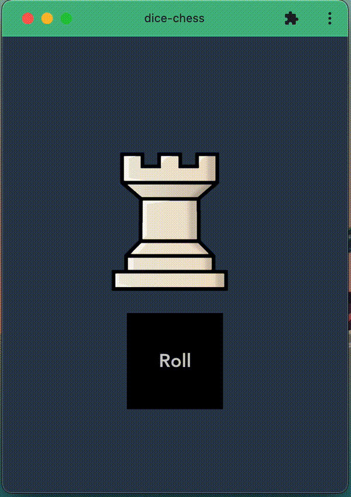

# dice-chess

## Preview

## How to use

Just visit [dice-chess.vercel.app/](https://dice-chess.vercel.app/) . Simply click the roll button and it will show you different pieces. We have introduced movements for light-squared-bishop and dark-squared-bishop and the light-bishop represents a movement for the light-squared bishop and dark-bishop represents for the dark-squared bishop.  

It can be installed as a PWA(progressive web-app). Here's how to install it as a PWA [support.google.com/chrome/answer/9658361?co=GENIE.Platform%3DDesktop&hl=en](https://support.google.com/chrome/answer/9658361?co=GENIE.Platform%3DDesktop&hl=en).  

Take care and keep protecting the 👑.